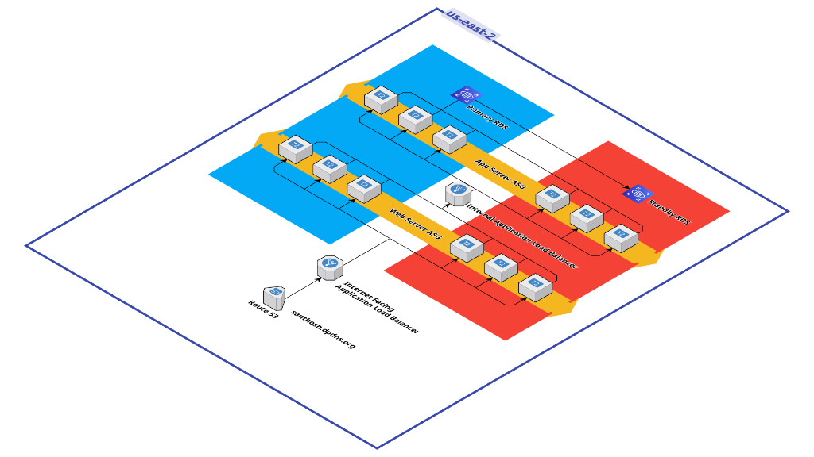
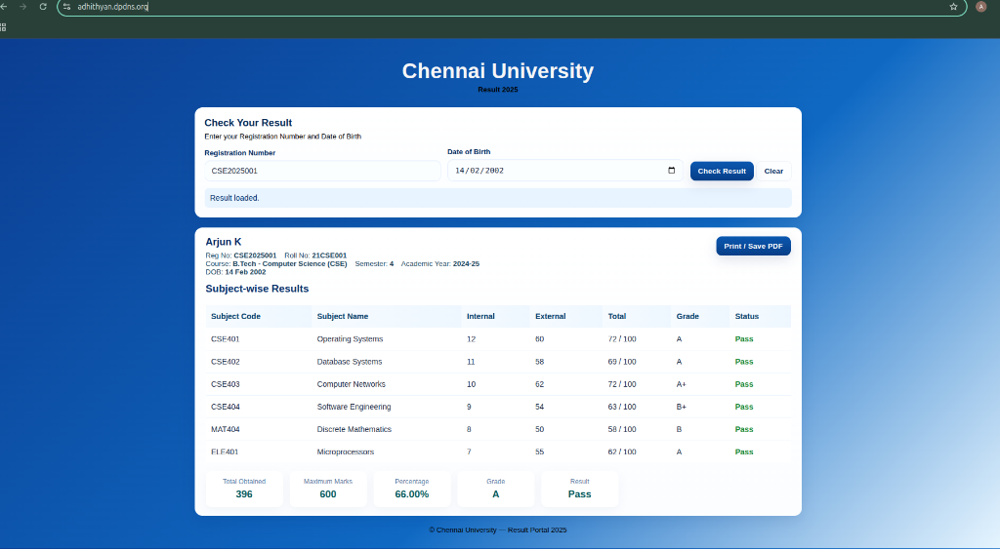
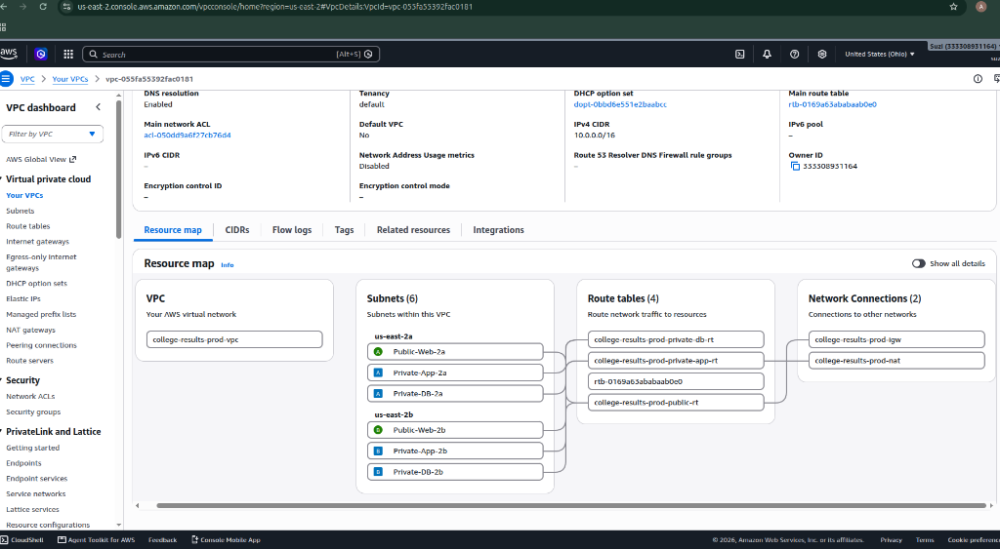
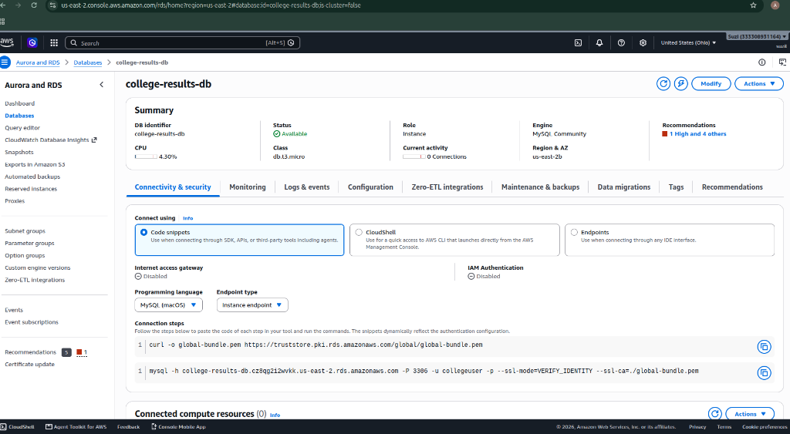
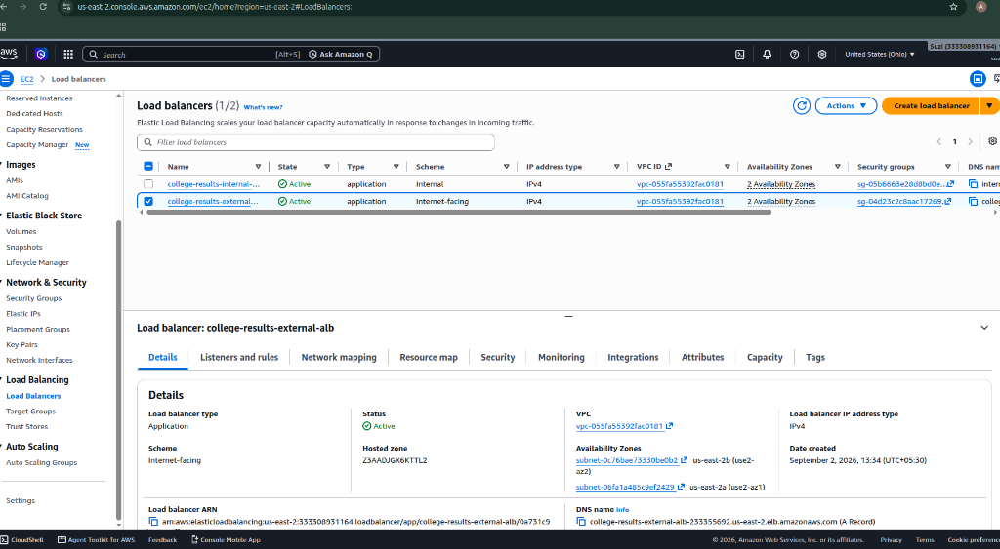
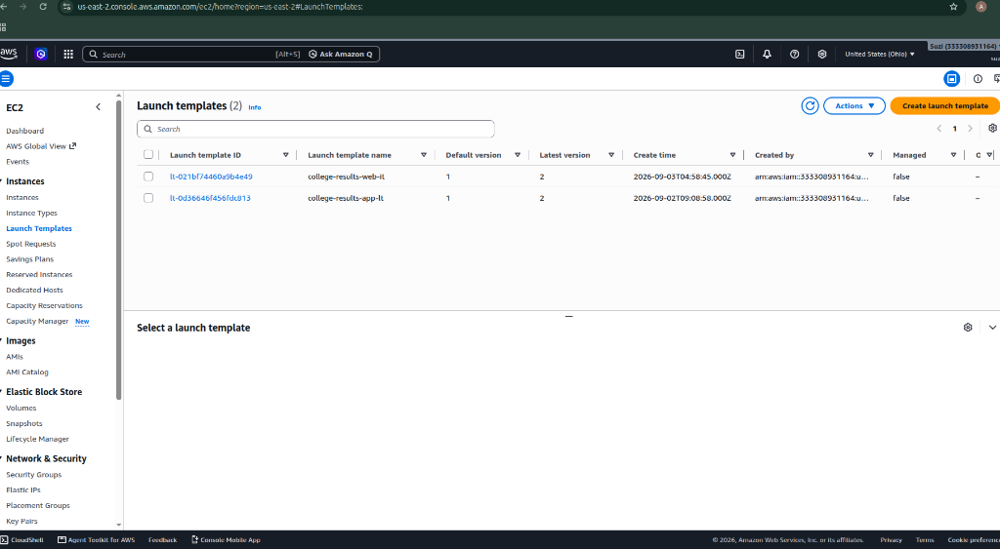

# College Exam Result Website — AWS 3-Tier Highly Available Architecture

[](https://aws.amazon.com/)
[](#3-architecture)
[](docs/23-terraform.md)
[](#final-validation-checklist)

A highly available, fault-tolerant, and secure enterprise-grade 3-tier web application architecture deployed on Amazon Web Services (AWS) using both manual console implementation and automated Terraform Infrastructure as Code (IaC).

---

## 1. Project Overview

This project provides a robust, scalable cloud infrastructure for hosting the **College Exam Result Website**. The system processes student examination queries by serving static assets from NGINX web servers, delegating API processing to Flask application nodes, and querying student records stored in a Multi-AZ Amazon RDS MySQL database.

### Problem Solved
Traditional monolithic application deployments on single servers suffer from severe single-point-of-failure risks, database downtime under high load during result announcements, security vulnerabilities from exposing databases directly to the public internet, and unmanaged compute scaling.

### Architectural Selection & Rationale
- **3-Tier Architecture**: Establishes rigid network boundaries separating presentation (Web), business logic (App), and persistence (Database) layers.
- **AWS Cloud**: Provides multi-availability zone infrastructure, managed databases, elastic load balancing, and auto-scaling compute.
- **Load Balancers (ALB)**: Segregates public internet traffic (External ALB) from internal microservice communication (Internal ALB).
- **Auto Scaling Groups (ASG)**: Maintains compute capacity across Availability Zones and automatically replaces unhealthy EC2 instances.
- **Amazon RDS Multi-AZ**: Replaces single EC2-hosted database with a managed MySQL instance offering automatic failover, automated backups, and storage encryption.

---

## 2. Project Objectives

- **High Availability**: Deploy compute across 2 Availability Zones (`us-east-2a` and `us-east-2b`) with zero single points of failure.
- **Network Isolation**: Restrict Application and Database instances to private subnets without public IP addresses.
- **Least-Privilege Security**: Enforce security group chaining (`Internet -> External ALB SG -> Web SG -> Internal ALB SG -> App SG -> DB SG`).
- **Managed Database Resilience**: Provision Multi-AZ Amazon RDS MySQL with automatic failover and persistent storage encryption.
- **Self-Healing Infrastructure**: Configure Launch Templates and Auto Scaling Groups for dynamic instance replacement.
- **Secure Access Control**: Eliminate public SSH ports by utilizing AWS Systems Manager (SSM) Session Manager.
- **Infrastructure as Code**: Automate the entire validated architecture using Terraform modules.

---

## 3. Architecture

### Architecture Diagram



> 📸 Screenshot: AWS 3-Tier Highly Available Architecture Diagram

### Architecture Component Breakdown

1. **Route 53 (`adhithyan.dpdns.org`)**: Managed DNS resolution routing user browser requests via Alias A records to the External ALB.
2. **Internet-Facing External ALB**: Positioned in public subnets (`Public-Web-2a` and `Public-Web-2b`); handles TLS/SSL termination and balances web traffic across NGINX nodes.
3. **Web Tier Auto Scaling Group**: Maintains 2 NGINX EC2 instances across 2 public subnets serving frontend assets (`index.html`, `script.js`, `styles.css`) and proxying `/api/` requests to the Internal ALB.
4. **Internal Application Load Balancer**: Positioned in private application subnets (`Private-App-2a` and `Private-App-2b`); routes internal API calls exclusively from Web EC2 instances to App nodes.
5. **Application Tier Auto Scaling Group**: Maintains 2 Flask/Gunicorn EC2 instances running Python business logic on port 8000 in private app subnets.
6. **Amazon RDS MySQL Multi-AZ**: Primary database instance deployed in `Private-DB-2b` with a synchronous standby instance in `Private-DB-2a` for automatic database failover.

---

## 4. Architecture Flow

```
Internet
   |
   v
Route 53 (adhithyan.dpdns.org)
   |
   v
External ALB (Public Subnets 2a/2b)
   |
   +-----------------------+
   |                       |
Web EC2 (Web-2a)        Web EC2 (Web-2b)   <--- Web Server ASG (NGINX :80)
   |                       |
   +-----------+-----------+
               | /api/
               v
      Internal ALB (Private App Subnets 2a/2b)
               |
               +-----------------------+
               |                       |
      App EC2 (App-2a)        App EC2 (App-2b) <--- App Server ASG (Flask :8000)
               |                       |
               +-----------+-----------+
                           | MySQL 3306
                           v
              Amazon RDS MySQL Multi-AZ (Private DB Subnets 2a/2b)
```

### Hops Breakdown
1. **User Connection**: User requests `https://adhithyan.dpdns.org` in their web browser.
2. **DNS Resolution**: Route 53 returns the IP address endpoints of the External Application Load Balancer.
3. **External ALB Routing**: External ALB receives traffic on port 443 (HTTPS), terminates SSL, and forwards HTTP traffic to the `Web-TG` target group on port 80.
4. **Web Tier Processing**: NGINX receives the request, serves static HTML/CSS/JS files, and forwards `/api/check_result` calls to the Internal ALB DNS name.
5. **Internal ALB Routing**: Internal ALB receives traffic on port 80 and forwards requests to the `App-TG` target group on port 8000.
6. **Application Tier Execution**: Gunicorn/Flask application on an App EC2 node executes business logic and initiates a database query.
7. **Database Query**: Flask connects to the RDS Endpoint on TCP port 3306 in the private database subnet.
8. **Response Return**: MySQL returns matching student data through Flask -> Gunicorn -> Internal ALB -> NGINX -> External ALB -> User Browser.

---

## 5. AWS Resource Inventory

| Component | Name | Type / Size | Purpose | Subnet / Placement |
| :--- | :--- | :--- | :--- | :--- |
| **VPC** | `college-results-prod-vpc` | VPC (`10.0.0.0/16`) | Isolated virtual network | `us-east-2` |
| **Public Subnet 1** | `Public-Web-2a` | Subnet (`10.0.1.0/24`) | Web tier compute & NAT | `us-east-2a` |
| **Public Subnet 2** | `Public-Web-2b` | Subnet (`10.0.2.0/24`) | Web tier compute & ALB | `us-east-2b` |
| **Private App 1** | `Private-App-2a` | Subnet (`10.0.3.0/24`) | App tier compute | `us-east-2a` |
| **Private App 2** | `Private-App-2b` | Subnet (`10.0.4.0/24`) | App tier compute & Internal ALB | `us-east-2b` |
| **Private DB 1** | `Private-DB-2a` | Subnet (`10.0.5.0/24`) | Standby RDS database | `us-east-2a` |
| **Private DB 2** | `Private-DB-2b` | Subnet (`10.0.6.0/24`) | Primary RDS database | `us-east-2b` |
| **IGW** | `college-results-prod-igw` | Internet Gateway | Inbound/outbound public routing | Attached to VPC |
| **NAT Gateway** | `college-results-prod-nat` | NAT Gateway | Private subnet outbound internet | `Public-Web-2a` |
| **External ALB** | `college-results-external-alb` | Application Load Balancer | Internet traffic entry | `Public-Web-2a`, `Public-Web-2b` |
| **Internal ALB** | `college-results-internal-alb` | Application Load Balancer | Internal microservice router | `Private-App-2a`, `Private-App-2b` |
| **RDS Instance** | `college-results-db` | `db.t3.micro` MySQL 8.0 | Persistent transactional data | `Private-DB-2a`, `Private-DB-2b` |
| **Web ASG** | `college-results-web-asg` | Auto Scaling Group | Web tier availability | `Public-Web-2a`, `Public-Web-2b` |
| **App ASG** | `college-results-app-asg` | Auto Scaling Group | App tier availability | `Private-App-2a`, `Private-App-2b` |
| **Route 53 Zone** | `adhithyan.dpdns.org` | Hosted Zone | DNS record resolution | Global / AWS DNS |

---

## 6. Network Design

| Tier | Availability Zone | Subnet Name | CIDR Block | Access Type | Primary Function |
| :--- | :--- | :--- | :--- | :--- | :--- |
| **Web** | `us-east-2a` | `Public-Web-2a` | `10.0.1.0/24` | Public | Web EC2, External ALB, NAT Gateway |
| **Web** | `us-east-2b` | `Public-Web-2b` | `10.0.2.0/24` | Public | Web EC2, External ALB |
| **App** | `us-east-2a` | `Private-App-2a` | `10.0.3.0/24` | Private | App EC2, Internal ALB |
| **App** | `us-east-2b` | `Private-App-2b` | `10.0.4.0/24` | Private | App EC2, Internal ALB |
| **DB** | `us-east-2a` | `Private-DB-2a` | `10.0.5.0/24` | Private | RDS Standby Instance |
| **DB** | `us-east-2b` | `Private-DB-2b` | `10.0.6.0/24` | Private | RDS Primary Instance |

---

## 7. Security Group Flow

```
Internet (0.0.0.0/0)
   | HTTP (80) / HTTPS (443)
   v
External-ALB-SG (sg-04d23c2c8aac17269)
   | HTTP (80)
   v
Web-SG (sg-05b6663e28d0bd0e)
   | HTTP (80)
   v
Internal-ALB-SG (sg-05b6663e28d0bd0e)
   | Custom TCP (8000)
   v
App-SG (sg-05b6663e28d0bd0e)
   | MySQL TCP (3306)
   v
DB-SG (sg-05b6663e28d0bd0e)
```

### Rules Summary
- **External ALB SG**: Allows Inbound TCP 80 & 443 from `0.0.0.0/0`.
- **Web SG**: Allows Inbound TCP 80 ONLY from `External-ALB-SG`.
- **Internal ALB SG**: Allows Inbound TCP 80 ONLY from `Web-SG`.
- **App SG**: Allows Inbound TCP 8000 ONLY from `Internal-ALB-SG`.
- **DB SG**: Allows Inbound TCP 3306 ONLY from `App-SG`.

---

## 8. Complete Execution Roadmap

- **Phase 1 — VPC & Networking**: [docs/01-vpc-networking.md](docs/01-vpc-networking.md)
- **Phase 2 — Internet Gateway Setup**: [docs/02-internet-gateway.md](docs/02-internet-gateway.md)
- **Phase 3 — NAT Gateway Setup**: [docs/03-nat-gateway.md](docs/03-nat-gateway.md)
- **Phase 4 — Route Tables Configuration**: [docs/04-route-tables.md](docs/04-route-tables.md)
- **Phase 5 — Security Groups Definition**: [docs/05-security-groups.md](docs/05-security-groups.md)
- **Phase 6 — Amazon RDS MySQL Deployment**: [docs/06-rds-mysql.md](docs/06-rds-mysql.md)
- **Phase 7 — Application Tier Setup**: [docs/07-app-tier.md](docs/07-app-tier.md)
- **Phase 8 — Internal Load Balancer Provisioning**: [docs/08-internal-alb.md](docs/08-internal-alb.md)
- **Phase 9 — Web Tier & NGINX Setup**: [docs/09-nginx-web-tier.md](docs/09-nginx-web-tier.md)
- **Phase 10 — External Load Balancer Provisioning**: [docs/10-external-alb.md](docs/10-external-alb.md)
- **Phase 11 — Target Groups Configuration**: [docs/11-target-groups.md](docs/11-target-groups.md)
- **Phase 12 — Launch Templates Setup**: [docs/12-launch-templates.md](docs/12-launch-templates.md)
- **Phase 13 — Auto Scaling Groups Deployment**: [docs/13-auto-scaling-groups.md](docs/13-auto-scaling-groups.md)
- **Phase 14 — Route 53 DNS Configuration**: [docs/14-route53.md](docs/14-route53.md)
- **Phase 15 — ACM SSL/TLS & HTTPS Listener**: [docs/15-acm-https.md](docs/15-acm-https.md)
- **Phase 16 — CloudWatch Metrics & Monitoring**: [docs/16-cloudwatch.md](docs/16-cloudwatch.md)
- **Phase 17 — IAM Roles & SSM Session Manager**: [docs/17-iam-ssm.md](docs/17-iam-ssm.md)
- **Phase 18 — Manual Testing Checklist**: [docs/18-manual-testing.md](docs/18-manual-testing.md)
- **Phase 19 — Troubleshooting & Failure Analysis**: [docs/19-troubleshooting.md](docs/19-troubleshooting.md)
- **Phase 20 — Security Architecture & Guidelines**: [docs/20-security.md](docs/20-security.md)
- **Phase 21 — High Availability Strategy**: [docs/21-high-availability.md](docs/21-high-availability.md)
- **Phase 22 — Disaster & Failure Testing**: [docs/22-disaster-failure-testing.md](docs/22-disaster-failure-testing.md)
- **Phase 23 — Terraform Infrastructure Automation**: [docs/23-terraform.md](docs/23-terraform.md)
- **Phase 24 — End-to-End Master Execution Guide**: [docs/24-project-execution.md](docs/24-project-execution.md)

---

## 9. Manual Implementation vs Terraform Automation

> ⚠️ **IMPORTANT DISTINCTION**:
> The infrastructure was initially built and validated **MANUALLY** via AWS Console and CLI commands to verify network routing, security group rules, load balancer health checks, and database connectivity.
> Once verified, the infrastructure was modularized and automated using **Terraform Infrastructure as Code (IaC)** located in the `terraform/` directory.

---

## 10. Implementation Console & Live Interface Proof Screenshots

> 📸 Screenshot: Live Application Interface (`https://adhithyan.dpdns.org`)
> 

> 📸 Screenshot: VPC Resource Map (`college-results-prod-vpc`)
> 

> 📸 Screenshot: Amazon RDS Database (`college-results-db`)
> 

> 📸 Screenshot: Application Load Balancers (`external` and `internal`)
> 

> 📸 Screenshot: EC2 Launch Templates (`college-results-web-lt` and `college-results-app-lt`)
> 

---

## 11. Cost Considerations

| AWS Service | Cost Factor | Optimization Implemented |
| :--- | :--- | :--- |
| **EC2 Instances** | Per instance hour (`t3.micro`) | AWS Free Tier eligible instances |
| **NAT Gateway** | Per GB data + hourly charge | Single NAT Gateway deployed in `Public-Web-2a` |
| **Application Load Balancers** | Hourly + LCU charges | Shared Target Groups across ASGs |
| **RDS MySQL** | Instance hours (`db.t3.micro`) + 20GB GP2 storage | Single DB instance in dev, Multi-AZ in prod |

---

## 12. Future Improvements

1. **AWS Secrets Manager Integration**: Replace local `.env` files on EC2 instances with Secrets Manager dynamic credential retrieval.
2. **AWS WAF Integration**: Attach Web Application Firewall to External ALB for SQL Injection and Rate Limiting defense.
3. **Amazon CloudFront CDN**: Serve static frontend assets (`index.html`, `styles.css`) via CloudFront edge locations backed by S3.
4. **CI/CD Pipeline**: Automate deployment via GitHub Actions to update Launch Templates and trigger ASG instance refreshes automatically.

---

## Final Validation Checklist

- [x] **VPC & Subnets**: VPC `10.0.0.0/16` created with 6 subnets across 2 AZs (`us-east-2a`, `us-east-2b`).
- [x] **Routing**: Internet Gateway attached to public subnets; NAT Gateway attached to private subnets.
- [x] **Database**: RDS MySQL 8.0 active in private DB subnets; database schema imported successfully.
- [x] **Application Tier**: Flask running under Gunicorn WSGI on port 8000; `/health` returns status `200`.
- [x] **Internal ALB**: Internal ALB active in private app subnets; routing traffic from Web to App tier.
- [x] **Web Tier**: NGINX web server operational; proxying `/api/` calls to Internal ALB.
- [x] **External ALB**: Internet-facing ALB active in public subnets; routing external traffic to Web tier.
- [x] **Auto Scaling**: Web ASG and App ASG maintaining 2 healthy instances across 2 AZs.
- [x] **DNS & HTTPS**: Route 53 resolving `adhithyan.dpdns.org`; ACM SSL certificate issued and attached to HTTPS listener.
- [x] **Terraform Automation**: Clean, validated Terraform configuration pushed as version `vrsion1`.
